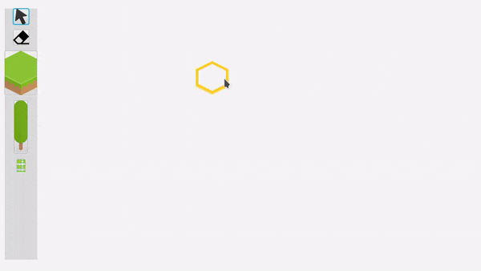
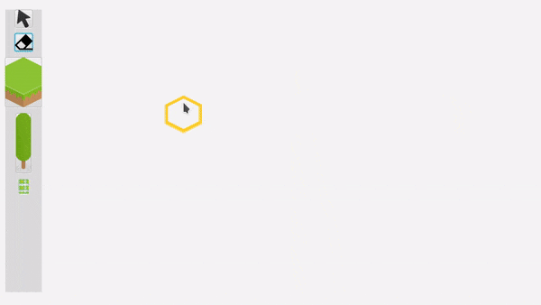
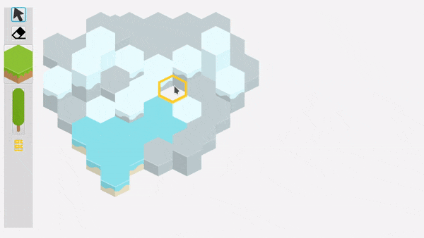
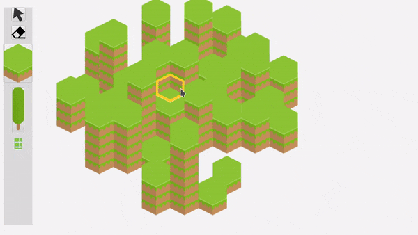
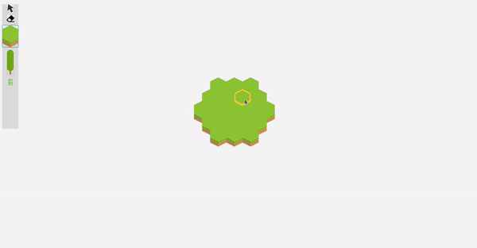

# PROZ-Project

This is a simple hexagonal map creator written in Java and JavaFX.  

## Requirements

To be able to run this project you need to have Java 8 (at least) and JavaFX installed on your computer. 

## Examples

With this map creator you can:

- create tiles on a grid  

- there is a variaty of tiles that can be used  

- you can add objects on each tile  

- with eraser tool tiles can be easily removed  

- maps can be saved via menu and loaded later on  

## Additional information

The tileset used in the project can be found [here](https://opengameart.org/content/hexagon-tiles-93x).  
[This great blog](https://www.redblobgames.com/grids/hexagons/) describes implementation of hexagonal grids.
